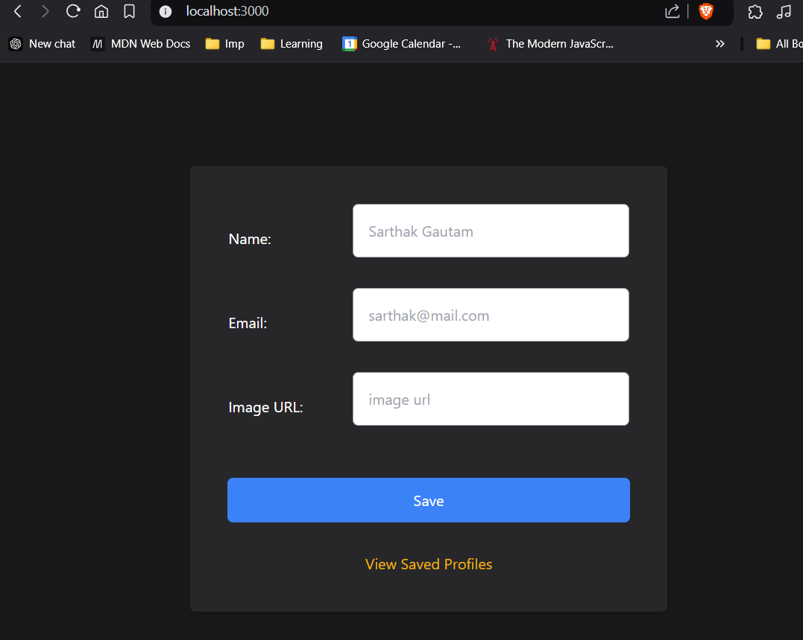

## Handling data with server side rendering

Installing all dependencies
```
npm init -y
npm i express
npm i mongoose

npm i --save-dev nodemon
npm i ejs
```

To-dos:
- at root '/'- setup form that inputs user name email and image url
- after creation redirect to '/view' where you can view user data stored from form. And can edit and delete it.




