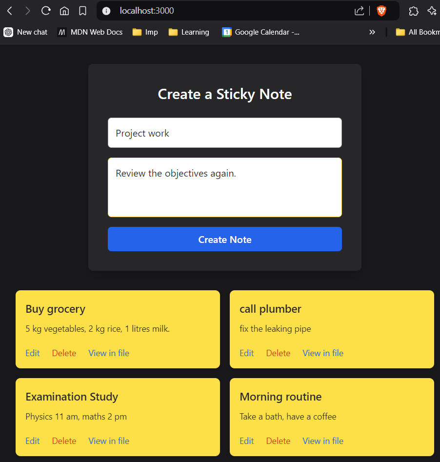
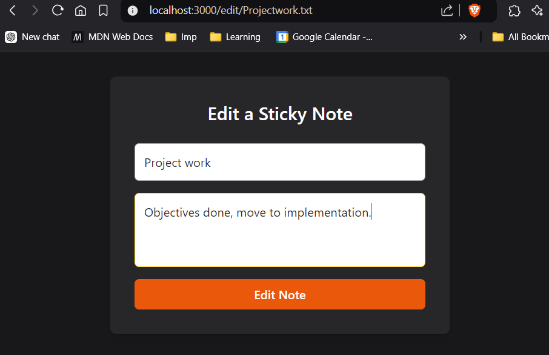
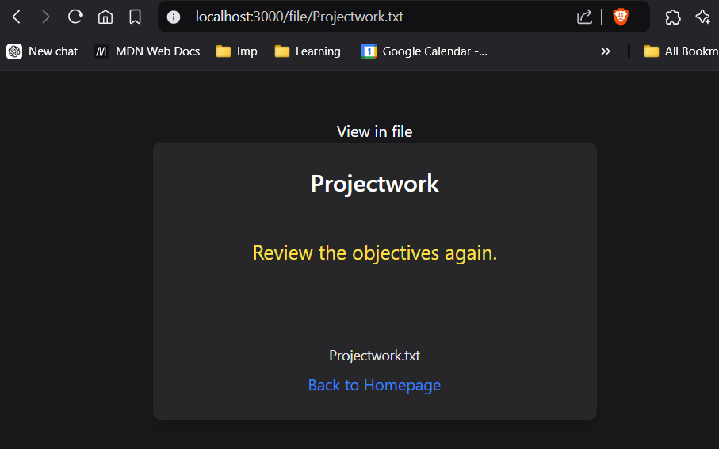

# Sticky Notes Mini Project

This is a basic Sticky Notes Application built using Node.js, Express.js, and the File System (fs) module for handling file operations (creating, reading, updating, and deleting notes).


It doesn't use any database;
instead, each sticky note is saved as a .txt file in the local file system.



The project allows you to:

-Create sticky notes.
-View the contents of sticky notes.
-Edit existing notes.
-Delete notes.




## Notes : for revision

### File System Module (fs) Overview

Node.js comes with the built-in `fs` module, which provides an API to interact with the file system. In this project, we use the following key methods of the `fs` module to manage sticky notes:

#### 1. `fs.writeFile()`
- **Purpose**: To create a new file or update an existing file with new content.
- **Syntax**:
  ```js
  fs.writeFile('path_to_file', 'content_to_write', (error) => {
      if (error) throw error;
      console.log('File created/updated successfully');
  });
  ```


#### 2. **`fs.readFile()`**:  
   `fs.readFile()` is used to read the content of a file. In this project, it's responsible for retrieving the content of a sticky note to be displayed when the note is viewed or edited.

```js
fs.readFile('path_to_file', 'utf-8', (error, data) => {
    if (error) throw error;
    console.log(data);
});

```


#### 3. **`fs.rename()`**:  
   This method allows for renaming or moving a file. When a sticky note's title is changed during editing, the file representing the note is renamed using `fs.rename()`.

```js
fs.rename('old_path', 'new_path', (error) => {
    if (error) throw error;
    console.log('File renamed successfully');
});

```

#### 4. **`fs.unlink()`**:  
   `fs.unlink()` is used to delete a file. This method is employed when a sticky note is deleted from the system.
```js
fs.unlink('path_to_file', (error) => {
    if (error) throw error;
    console.log('File deleted successfully');
});

```
