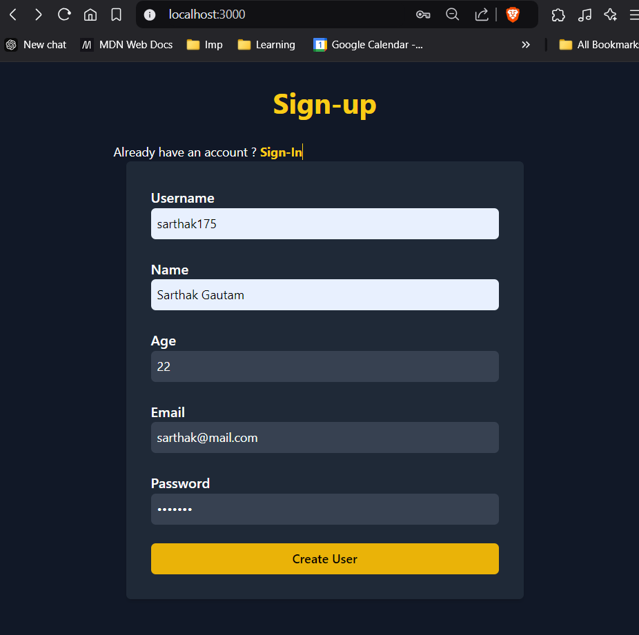
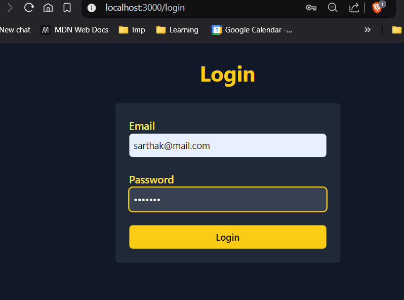
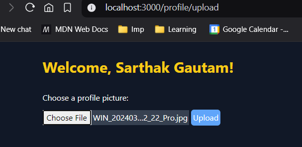
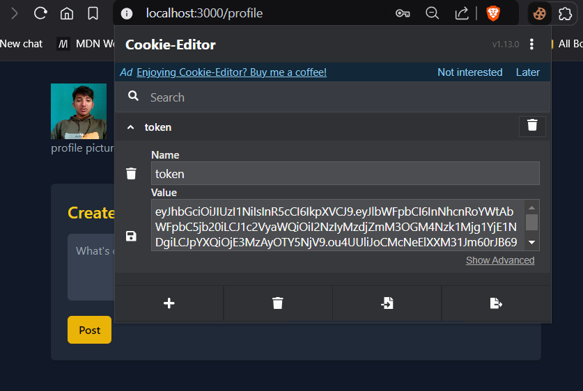
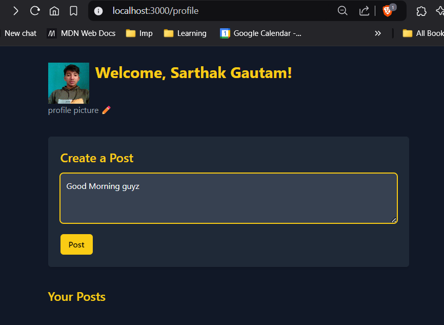
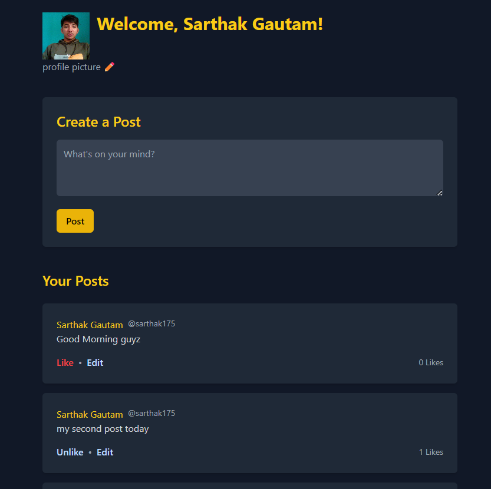

# user_post_auth_miniproject

This is a basic twitter-like mini-project where we use server side rendering to demonstrate backend concepts.
It is built with Node.js, Express, MongoDB, and EJS that includes user authentication, CRUD operations for posts, profile picture uploads, and cookie-based session management. It allows users to register, log in, create posts, like posts, and upload profile pictures.

## Installation:

```
npm init -y
npm i express mongoose ejs jsonwebtoken cookie-parser bcrypt
npm i --save-dev nodemon
npm i --save multer
```

## Features

- **User Registration & Login**:  
  Users can register with a unique email and password, with checks to prevent duplicate emails in the system.

  
  

- **Bcrypt**
  To protect direct acess to passwords from DB.

- **Profile Picture Upload**:  
  Allows users to upload profile pictures via Multer, with images stored locally on the server.
  

- **JWT Tokens**:  
  Utilizes JSON Web Tokens (JWT) along with cookies to manage user sessions, allowing secure access to protected routes.
  

- **Posts CRUD**:  
  Provides functionality for users to create, view, delete, and like posts, with permissions based on user authentication.
  
  


- **Data Associations**:  
  Posts are associated with users, and the likes feature is tracked through references in both user and post schemas.


## DB models :

user : username, name, age, email, password, profile_pic, post(postid)
post : user(userid), datem content, likes(userid) 
    
